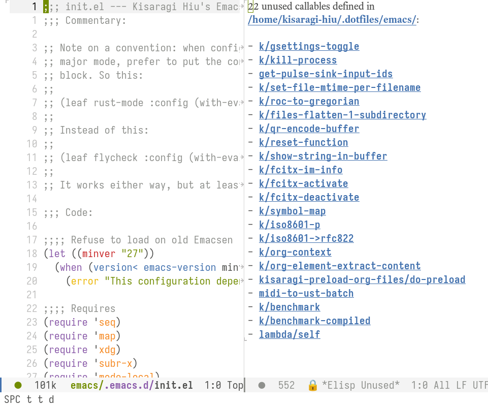

# elisp-unused

List all unused functions or macros in an Emacs Lisp project.

I haven't been able to find a command that lists all unused functions in an Emacs Lisp project, so here's my attempt at it.

## Install

```elisp
(straight-use-package '(elisp-unused :host github :repo "kisaragi-hiu/elisp-unused"))
```

## Usage

After installation, the command `elisp-unused-list-unused-callables` will become available. Run it in an Emacs Lisp project, then all unused functions and macros will be listed in a new buffer.



## Caveats

Commands are always considered “used” because they are supposed to be used by something outside the project. This should apply to public functions as well, but I don't think that's possible since there is no reliable way to tell a public function from a private one.

Only top level functions are discovered; even text that looks like function definitions in strings end up being discovered. It's worked well enough for myself though.

I decided to (ab)use [dumb-jump](https://github.com/jacktasia/dumb-jump)'s facilities to find references and definitions, as it felt faster and easier than using `read` and scanning through files myself. This is… inelegant. For example, this is what I did to make `dumb-jump-fetch-results` work for this project:

```elisp
(let ((results (cl-letf (((symbol-function 'dumb-jump--get-symbol-start)
                          (lambda (&rest _) nil))
                         ((symbol-function 'dumb-jump-get-point-context)
                          (lambda (&rest _) nil))
                         ((symbol-function 'dumb-jump-get-point-line)
                          (lambda (&rest _) nil))
                         ((symbol-function 'dumb-jump-get-point-symbol)
                          (lambda (&rest _) thing))
                         ((symbol-function 'dumb-jump-get-ctx-type-by-language)
                          (lambda (&rest _) "function")))
                 (dumb-jump-fetch-results
                  (or (buffer-file-name) default-directory)
                  (or project (projectile-project-root))
                  "elisp"
                  nil)))))
```

# License

[GPLv3](./LICENSE).
